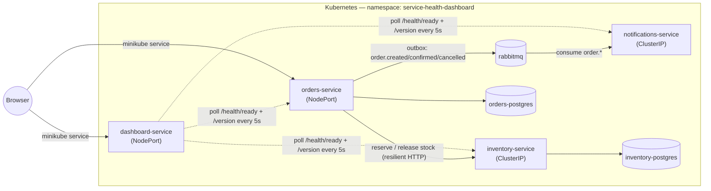

# Service Health & Deployment Dashboard

[](https://github.com/shineIB/service-health-dashboard/actions/workflows/ci.yml)

A small e-commerce backend built to demonstrate *running* a microservice system, not just writing one — three .NET services on Kubernetes, watched by a fourth that reports their live health without ever depending on them staying up.

Orders and inventory coordinate over HTTP with real failure handling (timeouts, retries, circuit breaking, idempotency); orders-service publishes order-lifecycle events over RabbitMQ that notifications-service consumes independently; `dashboard-service` polls all three and serves a small React SPA showing what it finds.

**.NET 9 · EF Core · PostgreSQL · RabbitMQ · OpenTelemetry · Kubernetes · React**

## Architecture



`orders-service` validates and reserves stock in `inventory-service` synchronously before accepting an order, then stages an event in the same Postgres transaction as the order itself — a background dispatcher publishes it to RabbitMQ afterwards, so the order never waits on the broker (see "Events" below). `notifications-service` consumes those events independently and logs a simulated confirmation. `dashboard-service` polls all three on its own schedule and serves a small React SPA showing what it finds — it never proxies a browser request into any of them.

## The dashboard

Status is coded in shape and color together — a solid pill with a checkmark for Healthy, solid amber with a warning triangle for Unhealthy, and a **dashed, hollow** pill with a slash for Unreachable, so "didn't respond at all" never looks like a shade of "responded but sick." Version, response time, and last-successful-check are all live and update every 5 seconds.

**Healthy** — all three monitored services up:


**`inventory-service` scaled to 0 replicas** — the dashboard marks it `Unreachable` (not "red like Unhealthy"), keeps its last-known version and shows *when* it was last seen, while `orders-service` and the dashboard itself stay unaffected:


## Architecture decisions

**Fail-closed, not optimistic.** `orders-service` rejects an order it can't confirm stock for, rather than accepting it and reconciling later. The alternative — accept now, settle later — was rejected because overselling is more expensive to unwind than a customer seeing a retryable `503`. Backed by a Polly v8 resilience pipeline (timeout, retry with backoff + jitter, circuit breaker) that only retries transient failures, never a `409` (insufficient stock) or `404`.

**Idempotency via order ID.** Every stock reservation is keyed by the order's ID, so a retried request — including the resilience pipeline's own retries — can't double-reserve. The alternative, trusting the caller to never retry, doesn't hold once you've added retries yourself.

**TTL instead of compensating release.** A reservation expires on its own via a background sweep in `inventory-service`, instead of `orders-service` issuing a compensating "release" call when something fails downstream. A saga/compensating-transaction approach was rejected because the compensating call would go through the very service that may be the reason things are failing — TTL doesn't depend on anything else being reachable.

**Transactional outbox instead of publishing directly to RabbitMQ.** An order-lifecycle event is written to an `OutboxMessages` row in the same Postgres transaction as the order change itself, and a separate background dispatcher publishes it afterwards — `orders-service` never calls RabbitMQ from the request path at all. The alternative — publish directly to RabbitMQ right after the commit, catching and logging any failure so it could never fail the order — is simpler and was this project's first version (see git history), but has one real gap: a crash in the narrow window between the DB commit and the publish call loses that one event permanently, with nothing left anywhere to retry from. The outbox closes that gap by making the write itself the durable record, at the cost of a table, a migration, and a poll loop. See "Events" below for the full mechanics, including the bounded-retry/dead-letter handling on both ends.

**`/health/live` vs. `/health/ready`.** Live has no dependencies and is always healthy if the process is running; ready checks the database. Kubernetes uses live for restart decisions and ready for traffic routing. A single combined endpoint was rejected because it would turn a brief database hiccup into an unnecessary pod restart instead of just a short pause in traffic.

**notifications-service has no database, on purpose.** Its only job is reacting to events it doesn't own — adding a database just to store a dedupe set (see "Events" below) would mean a fourth Postgres instance, a fourth migration story, and a fourth thing that can be down, for a service whose entire value is being simple and disposable. The in-memory idempotency store is the direct consequence of that choice, not an oversight.

**The dashboard can't inherit anyone else's outage.** `dashboard-service`'s own `/health/ready` has zero registered checks, so it's structurally incapable of reporting unhealthy because a service it watches is down — confirmed above by scaling `inventory-service` to 0 while the dashboard stayed `Ready`. Tying its health to the services it monitors was rejected because that's exactly the tool you need most during an actual incident.

## Run it yourself

### Docker Compose

```bash
git clone https://github.com/shineIB/service-health-dashboard.git
cd service-health-dashboard
docker compose up --build
```

- Orders: http://localhost:8080
- Inventory: http://localhost:8081
- Dashboard: http://localhost:8082
- Notifications: http://localhost:8083 (no public API — `/health/*`, `/version`, `/metrics` only)
- RabbitMQ management UI: http://localhost:15672 (guest/guest)

### Kubernetes (minikube)

See [docs/RUNNING.md](docs/RUNNING.md) for the full walkthrough — building/loading images, Postgres, Jaeger, RabbitMQ, Prometheus + Grafana, opening each UI, and troubleshooting a stale `minikube image load`.

## Distributed tracing

OpenTelemetry traces every request across the services that talk to each other over HTTP — orders-service's own request, the outbound call into inventory-service, and both services' Postgres queries — using the standard W3C `traceparent` header, no custom propagation code required. Retries and circuit-breaker state changes from the Polly v8 resilience pipeline show up as their own spans, not just log lines. The RabbitMQ side gets the same treatment even though there's no HTTP call to propagate a header over: `OutboxDispatcher` wraps each publish in its own `order.publish-event` span (tagged with the outbox message id and routing key), and `notifications-service` wraps each consumed message in `notifications.handle-event` (tagged with the event id and type) — so a trace can show "this order's event was staged, published some time later once RabbitMQ was reachable, and consumed here" even though the two ends never share an HTTP request. Traces go to Jaeger (`k8s/jaeger`) over OTLP; every log line is enriched with `trace_id`/`span_id` so a log can be followed straight to its trace in Jaeger.

**A complete order** — `POST /orders` on orders-service, the resilient call into inventory-service, the manual `inventory.reserve` span (tagged with the order and product IDs), and both services' Postgres queries, all in one trace:


**`inventory-service` scaled to 0 replicas** — the same call now shows `OnRetry`, the circuit breaker's `OnCircuitOpened` event, and the failed HTTP attempt underneath it, all inside the trace instead of scattered across log lines:


## Metrics

All four services expose OpenTelemetry metrics at `GET /metrics` in Prometheus text format — ASP.NET Core/HttpClient request counts and latency histograms for free from auto-instrumentation, plus a handful of business counters for the outcomes that matter:

- **orders-service:** `orders_created_total`, `orders_rejected_total` (tagged `reason=insufficient_stock|inventory_unavailable`), `orders_cancelled_total`, and the outbox's own `orders_events_published_total`, `orders_events_publish_failed_total`, `orders_events_publish_abandoned_total` (tagged `event_type`) — see "Events" below for what "abandoned" means.
- **inventory-service:** `inventory_reservations_succeeded_total`, `inventory_reservations_failed_total` (tagged `reason=insufficient_stock`), `inventory_releases_total`.
- **notifications-service:** `notifications_sent_total`, `notifications_failed_total` (tagged `reason`), and `notifications_duplicate_total` — a redelivered event being acked without a second confirmation, not a failure.

Pull-based (scraped, not pushed over OTLP) — Jaeger only understands traces, and OTLP metric export needs something to receive it. Try it against the Docker Compose stack:

```bash
curl http://localhost:8080/metrics | grep orders_
curl http://localhost:8081/metrics | grep inventory_
curl http://localhost:8083/metrics | grep notifications_
```

## Metrics dashboards (Prometheus + Grafana)

In `k8s/`, not Docker Compose — this is infrastructure, not application code, and minikube is where it earns its keep. Prometheus discovers what to scrape via `kubernetes_sd_configs` (pod role) plus `prometheus.io/scrape`/`port`/`path` annotations on every Deployment — orders-service, inventory-service, notifications-service, and dashboard-service all carry them (`k8s/prometheus/configmap.yaml`). That's not hypothetical: notifications-service was added after this scrape config was written, and it started showing up in Prometheus's targets the moment its Deployment rolled out — no change to the ConfigMap needed. That's the actual point of annotation-based discovery over a hand-maintained target list, demonstrated by a real fourth service, not just asserted.

**Grafana's datasource and dashboard are provisioned as code** — two ConfigMaps (`k8s/grafana/datasource-configmap.yaml`, `k8s/grafana/dashboard-configmap.yaml`), not clicked together in the UI (`GF_AUTH_ANONYMOUS_ENABLED=true` even makes the UI read-only for exactly that reason — see `k8s/grafana/deployment.yaml`). A dashboard that only exists because someone built it by hand in the running pod disappears with that pod and was never in git; provisioning from a ConfigMap means the dashboard *is* version-controlled, and `kubectl apply` rebuilds it identically on a fresh cluster.

One dashboard, four panels chosen for what they say about *this* system specifically — no CPU/memory panels, which say nothing about it:

- **Orders created vs. rejected**, split by rejection reason (`insufficient_stock` vs `inventory_unavailable`)
- **Reservations succeeded vs. failed** on inventory-service
- **HTTP request duration p50/p95** for orders-service and inventory-service
- **orders-service → inventory-service call error rate** — deliberately excludes `409` (insufficient stock is a normal business outcome, not an error) so this panel reacts only to genuine infrastructure failure

**Scaling `inventory-service` to 0 while generating order traffic**, all four panels move together and then recover once it's scaled back up — rejections shift from `insufficient_stock` to `inventory_unavailable`, p95 latency climbs as the resilience pipeline retries, and the error-rate panel spikes to 100% and back down to 0 without anyone touching orders-service:


## Events (RabbitMQ, transactional outbox, idempotent consumer)

`orders-service` never calls RabbitMQ from the request path. When an order is created/confirmed/cancelled, the corresponding event is written to an `OutboxMessages` row **in the same Postgres transaction** as the order change itself — one commit, both rows, or neither. A separate `OutboxDispatcher` background service polls that table (every 2s) and publishes unpublished rows to a durable topic exchange (`orders`, routing keys `order.created`/`confirmed`/`cancelled`); a row that fails to publish just stays unpublished and gets retried on the next poll — RabbitMQ being down never loses it, because it was already durably committed before any network call was attempted. Retries are bounded, not infinite: after `Outbox:MaxAttempts` (default 20, ~40s of retrying) a row is marked `FailedAtUtc` and excluded from further attempts, logged at `Error`, so a row that can genuinely never publish stops consuming a batch slot forever — without that cutoff, enough such rows would eventually crowd out newer, healthy ones (`OrderBy(CreatedAtUtc)` always tries the oldest pending rows first). The row's payload and last error stay in Postgres either way; resetting `FailedAtUtc` to `NULL` re-queues it. See "Transactional outbox instead of publishing directly to RabbitMQ" under Architecture decisions above for why this replaced a simpler direct-publish design.

`notifications-service` binds its own queue to `order.*` and consumes independently — RabbitMQ *is* a hard dependency for it (unlike orders-service), so its own `/health/ready` reflects the connection directly. Because RabbitMQ only guarantees *at-least-once* delivery (and the dispatcher's own retries can legitimately republish a row that was actually delivered, just not yet marked as such), a redelivered event is expected, not a bug: each event carries a stable `EventId` — the outbox row's own `Id`, reused unchanged across every delivery attempt — and the consumer tracks which ids it has already acted on, acking a duplicate without sending a second confirmation. A message that fails to deserialize or map to a known event type is dead-lettered (`orders-notifications.dlq`) instead of looping forever or being silently dropped.

```bash
curl http://localhost:8083/metrics | grep notifications_
```

**Why in-memory idempotency, not a database, in notifications-service:** the service deliberately has no database (see "Architecture decisions" above). The dedupe set of recently-seen `EventId`s lives in one process's memory, which makes it **both per-process and per-instance**:

- **Per-process:** it does not survive a restart. A message redelivered *after* a restart (RabbitMQ requeues something unacked, the pod restarts, only then does the redelivery land) would be processed again — the dedupe window resets to empty along with everything else in memory.
- **Per-instance:** it is not shared across replicas. Today `notifications-service` runs as a single pod, so this doesn't come up — but RabbitMQ hands each message on a queue to *one* of its connected consumers (competing consumers), not to all of them, and it picks arbitrarily. Scale this deployment to 2+ replicas and a message delivered to pod A and a redelivery of the *same* message routed to pod B would not be deduped against each other — each pod only knows what it has personally seen.

Both gaps are the same trade-off from two angles: this is safe **only** because the side effect being deduplicated is a log line (`LoggingNotificationSender`), not a real action — processing the same event twice costs nothing worse than a duplicate log entry. The moment that side effect becomes something external and consequential (an actual email/SMS send, a charge, a write to another system), in-memory state stops being enough on both counts, and the fix is the same for both: move the processed-set to storage every replica can see and that survives a restart — a shared database table (Postgres, if this service ever gets one) or a dedicated store like Redis, keyed by `EventId` with a TTL, checked with an atomic "insert if absent."

## CI/CD

GitHub Actions (`.github/workflows/ci.yml`) runs on every push/PR to `master`: restore, build, test the whole solution, then build all four service images (catches a broken Dockerfile early). On a push to `master` specifically — not on PRs — a separate job also **publishes** those four images to GitHub Container Registry, tagged with both the short git SHA and `latest`, built with the same `GIT_SHA`/`BUILD_TIME` build args as the local `docker build` commands in [docs/RUNNING.md](docs/RUNNING.md) so a published image's `/version` endpoint shows a real commit and build time, not `"unknown"`.

If any job fails on a push to `master`, a final job opens a GitHub issue (labeled `ci-failure`, linking straight to the run) instead of relying on the CI badge above being the only signal — there's no public API for the personal "notify me on failed Actions" account setting, so an open issue on the repo itself is the automatable equivalent.

### Pulling published images

```bash
docker pull ghcr.io/shineib/orders-service:latest
docker pull ghcr.io/shineib/inventory-service:latest
docker pull ghcr.io/shineib/notifications-service:latest
docker pull ghcr.io/shineib/dashboard-service:latest

# Or pin to the exact commit an image was built from, instead of latest:
docker pull ghcr.io/shineib/orders-service:<short-sha>
```

GHCR packages are public for this repo — no `docker login` needed to pull.

### What this CI/CD pipeline does *not* do

**There is no auto-deploy, and there cannot be one against this project's own Kubernetes target as it's set up today.** Everything in [docs/RUNNING.md](docs/RUNNING.md) runs against a `minikube` cluster living on this machine's own Docker Desktop/Hyper-V — a GitHub-hosted runner has no network path to it, no `kubeconfig` for it, and nothing worth granting one even if it did (minikube isn't reachable from the internet, on purpose — it's a local dev cluster, not a deployment target). The pipeline's job ends at "an image exists in GHCR that `kubectl`/`minikube image load` could use next" — pulling it into minikube and rolling the Deployments is still the same manual `kubectl apply`/`minikube image load` sequence documented there. Claiming otherwise — a green checkmark that implies "and now it's live" — would be misleading about what actually happened. A real CD story would need a cluster GitHub Actions can actually reach (a cloud-hosted cluster, or a self-hosted runner with network access to this machine) plus something to drive the rollout (`kubectl set image`, ArgoCD/Flux watching the registry, etc.) — a different kind of infrastructure than "run it on my laptop," not a missing workflow step.

## Not done yet

- **No auto-deploy.** Deliberately out of scope for this repo, not an oversight — see "What this CI/CD pipeline does *not* do" under "CI/CD" above for why a GitHub-hosted runner can't reach a local minikube cluster and what a real deploy target would actually require.
- **No alerting on abandoned outbox rows.** `OutboxDispatcher` gives up on a row after `Outbox:MaxAttempts` (default 20, ~40s) and marks it `FailedAtUtc` instead of retrying forever — see "Events" above — but nothing currently watches for that happening. The row and its `LastError` stay in Postgres for manual inspection either way; a Grafana panel or alert on `orders_events_publish_abandoned_total` is the natural next step.
- **Grafana panels for notifications-service/the outbox.** The dashboard (`k8s/grafana/`) covers orders/inventory only; `notifications_sent_total`/`notifications_failed_total`/`notifications_duplicate_total` and the outbox's own publish counters are scraped by Prometheus already but not yet visualized.

Smaller, already-noted-but-deferred items live in `CLAUDE.md`: k8s-native service discovery for the dashboard instead of a config-driven list, SSE/WebSocket instead of polling, and a real deploy timestamp from the Kubernetes API instead of each service's build time.
