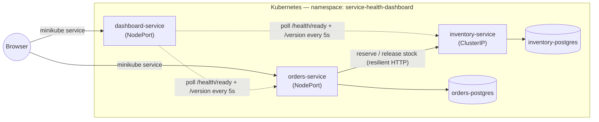

# Service Health & Deployment Dashboard

A small e-commerce backend built to demonstrate *running* a microservice system, not just writing one. Two .NET services — orders and inventory — coordinate over HTTP with real failure handling (timeouts, retries, circuit breaking, idempotency), run in Kubernetes, and are watched by a third service that reports their live health, version, and deploy info without ever depending on them staying up.

## Architecture



`orders-service` validates and reserves stock in `inventory-service` synchronously before accepting an order. `dashboard-service` polls both on its own schedule and serves a small React SPA showing what it finds — it never proxies a browser request into either service.

## Run it yourself

### Docker Compose

```bash
git clone https://github.com/shineIB/service-health-dashboard.git
cd service-health-dashboard
docker compose up --build
```

- Orders: http://localhost:8080
- Inventory: http://localhost:8081
- Dashboard: http://localhost:8082

### Kubernetes (minikube)

Everything lives in the `service-health-dashboard` namespace — pass `-n service-health-dashboard` (or `kubectl -n service-health-dashboard ...`) for every command below.

```bash
# Build and load the three images (no external registry)
docker build -t orders-service:local    -f src/OrdersService/OrdersService.Api/Dockerfile .
docker build -t inventory-service:local -f src/InventoryService/InventoryService.Api/Dockerfile .
docker build -t dashboard-service:local -f src/DashboardService/DashboardService.Api/Dockerfile .

minikube start
minikube image load orders-service:local
minikube image load inventory-service:local
minikube image load dashboard-service:local

# Namespace, then Postgres (Deployment + PVC) for both services
kubectl apply -f k8s/namespace.yaml
kubectl -n service-health-dashboard apply \
  -f k8s/orders-service/postgres-secret.yaml -f k8s/orders-service/postgres-pvc.yaml \
  -f k8s/orders-service/postgres-deployment.yaml -f k8s/orders-service/postgres-service.yaml \
  -f k8s/inventory-service/postgres-secret.yaml -f k8s/inventory-service/postgres-pvc.yaml \
  -f k8s/inventory-service/postgres-deployment.yaml -f k8s/inventory-service/postgres-service.yaml \
  -f k8s/orders-service/secret.yaml -f k8s/inventory-service/secret.yaml

kubectl -n service-health-dashboard rollout status deployment/orders-postgres
kubectl -n service-health-dashboard rollout status deployment/inventory-postgres

# Migrations run as one-shot Jobs, not on pod startup — see "Architecture decisions" below
kubectl -n service-health-dashboard apply -f k8s/orders-service/migration-job.yaml -f k8s/inventory-service/migration-job.yaml
kubectl -n service-health-dashboard wait --for=condition=complete job/orders-migrate --timeout=120s
kubectl -n service-health-dashboard wait --for=condition=complete job/inventory-migrate --timeout=120s

# The services themselves, plus the dashboard
kubectl -n service-health-dashboard apply \
  -f k8s/orders-service/deployment.yaml -f k8s/orders-service/service.yaml \
  -f k8s/inventory-service/deployment.yaml -f k8s/inventory-service/service.yaml \
  -f k8s/dashboard-service/deployment.yaml -f k8s/dashboard-service/service.yaml

kubectl -n service-health-dashboard rollout status deployment/orders-service
kubectl -n service-health-dashboard rollout status deployment/inventory-service
kubectl -n service-health-dashboard rollout status deployment/dashboard-service

# Opens a tunnel and prints a URL — on the Docker driver (Windows/macOS) this blocks
# and needs its terminal left open for the tunnel to stay up
minikube service dashboard-service -n service-health-dashboard
```

## The dashboard

Status is coded in shape and color together — a solid pill with a checkmark for Healthy, solid amber with a warning triangle for Unhealthy, and a **dashed, hollow** pill with a slash for Unreachable, so "didn't respond at all" never looks like a shade of "responded but sick." Version, response time, and last-successful-check are all live and update every 5 seconds.

**Healthy** — both services up:


**`inventory-service` scaled to 0 replicas** — the dashboard marks it `Unreachable` (not "red like Unhealthy"), keeps its last-known version and shows *when* it was last seen, while `orders-service` and the dashboard itself stay unaffected:


## Architecture decisions

**Fail-closed, not optimistic.** `orders-service` rejects an order it can't confirm stock for, rather than accepting it and reconciling later. The alternative — accept now, settle later — was rejected because overselling is more expensive to unwind than a customer seeing a retryable `503`. Backed by a Polly v8 resilience pipeline (timeout, retry with backoff + jitter, circuit breaker) that only retries transient failures, never a `409` (insufficient stock) or `404`.

**Idempotency via order ID.** Every stock reservation is keyed by the order's ID, so a retried request — including the resilience pipeline's own retries — can't double-reserve. The alternative, trusting the caller to never retry, doesn't hold once you've added retries yourself.

**TTL instead of compensating release.** A reservation expires on its own via a background sweep in `inventory-service`, instead of `orders-service` issuing a compensating "release" call when something fails downstream. A saga/compensating-transaction approach was rejected because the compensating call would go through the very service that may be the reason things are failing — TTL doesn't depend on anything else being reachable.

**`/health/live` vs. `/health/ready`.** Live has no dependencies and is always healthy if the process is running; ready checks the database. Kubernetes uses live for restart decisions and ready for traffic routing. A single combined endpoint was rejected because it would turn a brief database hiccup into an unnecessary pod restart instead of just a short pause in traffic.

**The dashboard can't inherit anyone else's outage.** `dashboard-service`'s own `/health/ready` has zero registered checks, so it's structurally incapable of reporting unhealthy because a service it watches is down — confirmed above by scaling `inventory-service` to 0 while the dashboard stayed `Ready`. Tying its health to the services it monitors was rejected because that's exactly the tool you need most during an actual incident.

## Not done yet

- **Observability (step 6).** No OpenTelemetry traces/metrics, no structured logging, no Prometheus/Grafana. Right now the only signal is the health/version data the dashboard already shows.
- **A third service and a real message bus (step 7).** `notifications-service` doesn't exist yet; orders→inventory is the only inter-service call, and it's synchronous HTTP, not events. Deferred deliberately — see `CLAUDE.md` for why the bus comes after two services are stable, not before.
- **CI/CD (step 8).** Everything above is built and deployed by hand (`docker build`, `minikube image load`, `kubectl apply`). No GitHub Actions pipeline yet for build/test/image push, let alone auto-deploy.

Smaller, already-noted-but-deferred items live in `CLAUDE.md`: k8s-native service discovery for the dashboard instead of a config-driven list, SSE/WebSocket instead of polling, and a real deploy timestamp from the Kubernetes API instead of each service's build time.
