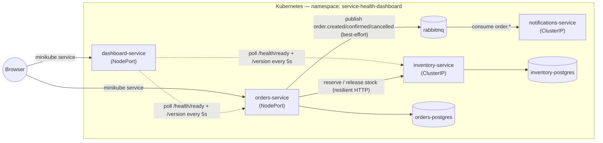
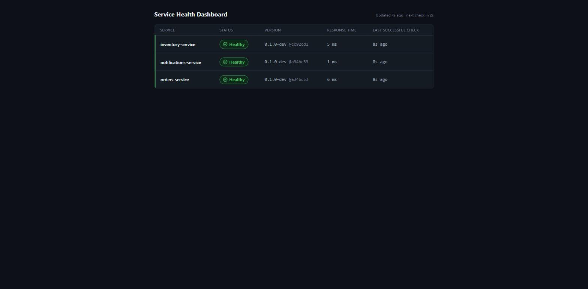
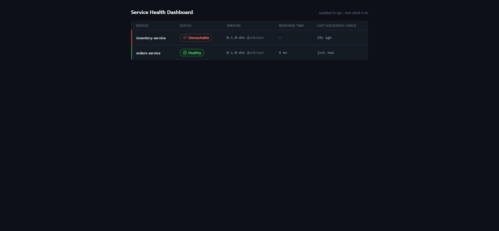
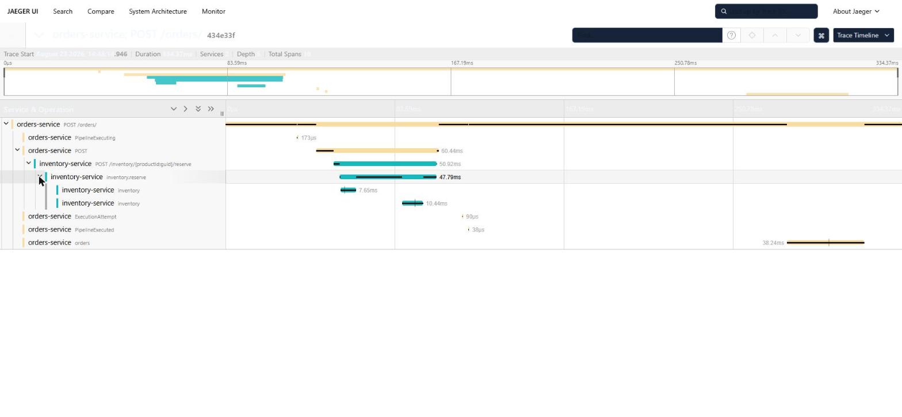
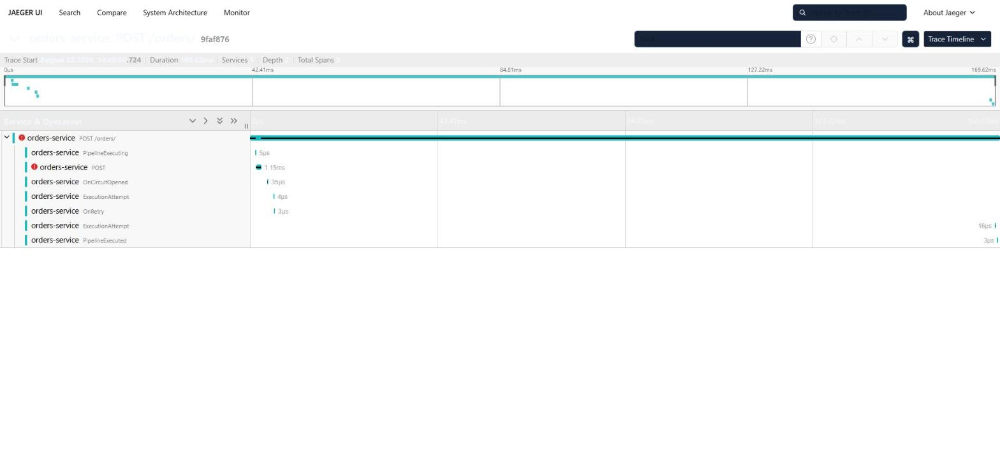
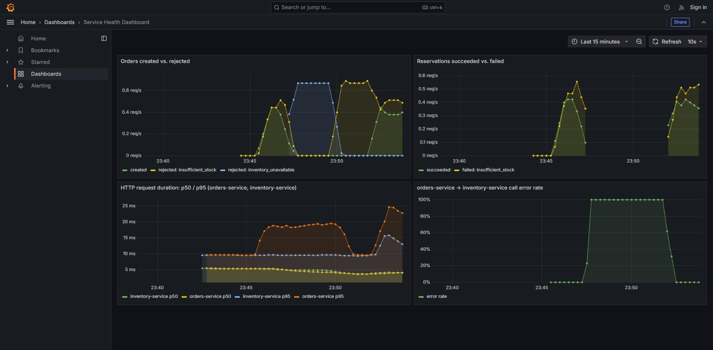

# Service Health & Deployment Dashboard

[](https://github.com/shineIB/service-health-dashboard/actions/workflows/ci.yml)

A small e-commerce backend built to demonstrate *running* a microservice system, not just writing one. Orders and inventory coordinate over HTTP with real failure handling (timeouts, retries, circuit breaking, idempotency); orders-service publishes order-lifecycle events over RabbitMQ that notifications-service consumes independently; all three run in Kubernetes and are watched by a fourth service that reports their live health, version, and deploy info without ever depending on them staying up.

## Architecture



`orders-service` validates and reserves stock in `inventory-service` synchronously before accepting an order, then publishes an event over RabbitMQ — best-effort, never blocking the order itself. `notifications-service` consumes those events independently and logs a simulated confirmation. `dashboard-service` polls orders/inventory on its own schedule and serves a small React SPA showing what it finds — it never proxies a browser request into either service.

## Run it yourself

### Docker Compose

```bash
git clone https://github.com/shineIB/service-health-dashboard.git
cd service-health-dashboard
docker compose up --build
```

- Orders: http://localhost:8080
- Inventory: http://localhost:8081
- Dashboard: http://localhost:8082
- Notifications: http://localhost:8083 (no public API — `/health/*`, `/version`, `/metrics` only)
- RabbitMQ management UI: http://localhost:15672 (guest/guest)

### Kubernetes (minikube)

Everything lives in the `service-health-dashboard` namespace — pass `-n service-health-dashboard` (or `kubectl -n service-health-dashboard ...`) for every command below.

```bash
# Build and load the four images (no external registry)
# GIT_SHA/BUILD_TIME are baked in as build args so the dashboard's "version"
# column shows something other than "unknown" — see Dockerfile comments.
GIT_SHA=$(git rev-parse --short HEAD)
BUILD_TIME=$(date -u +%Y-%m-%dT%H:%M:%SZ)
docker build -t orders-service:local        -f src/OrdersService/OrdersService.Api/Dockerfile        --build-arg GIT_SHA=$GIT_SHA --build-arg BUILD_TIME=$BUILD_TIME .
docker build -t inventory-service:local     -f src/InventoryService/InventoryService.Api/Dockerfile     --build-arg GIT_SHA=$GIT_SHA --build-arg BUILD_TIME=$BUILD_TIME .
docker build -t notifications-service:local -f src/NotificationsService/NotificationsService.Api/Dockerfile --build-arg GIT_SHA=$GIT_SHA --build-arg BUILD_TIME=$BUILD_TIME .
docker build -t dashboard-service:local     -f src/DashboardService/DashboardService.Api/Dockerfile     --build-arg GIT_SHA=$GIT_SHA --build-arg BUILD_TIME=$BUILD_TIME .

minikube start
minikube image load orders-service:local
minikube image load inventory-service:local
minikube image load notifications-service:local
minikube image load dashboard-service:local

# Namespace, then Postgres (Deployment + PVC) for both services
kubectl apply -f k8s/namespace.yaml
kubectl -n service-health-dashboard apply \
  -f k8s/orders-service/postgres-secret.yaml -f k8s/orders-service/postgres-pvc.yaml \
  -f k8s/orders-service/postgres-deployment.yaml -f k8s/orders-service/postgres-service.yaml \
  -f k8s/inventory-service/postgres-secret.yaml -f k8s/inventory-service/postgres-pvc.yaml \
  -f k8s/inventory-service/postgres-deployment.yaml -f k8s/inventory-service/postgres-service.yaml \
  -f k8s/orders-service/secret.yaml -f k8s/inventory-service/secret.yaml

kubectl -n service-health-dashboard rollout status deployment/orders-postgres
kubectl -n service-health-dashboard rollout status deployment/inventory-postgres

# Jaeger (traces UI) and RabbitMQ — nothing blocks on either being up first (orders-service's
# publish is best-effort, notifications-service retries its own initial connect), but they
# need to exist before the services that depend on them start doing anything useful with them
kubectl -n service-health-dashboard apply -f k8s/jaeger/deployment.yaml -f k8s/jaeger/service.yaml
kubectl -n service-health-dashboard apply -f k8s/rabbitmq/deployment.yaml -f k8s/rabbitmq/service.yaml
kubectl -n service-health-dashboard rollout status deployment/jaeger
kubectl -n service-health-dashboard rollout status deployment/rabbitmq

# Migrations run as one-shot Jobs, not on pod startup — see "Architecture decisions" below
kubectl -n service-health-dashboard apply -f k8s/orders-service/migration-job.yaml -f k8s/inventory-service/migration-job.yaml
kubectl -n service-health-dashboard wait --for=condition=complete job/orders-migrate --timeout=120s
kubectl -n service-health-dashboard wait --for=condition=complete job/inventory-migrate --timeout=120s

# The services themselves, plus the dashboard
kubectl -n service-health-dashboard apply \
  -f k8s/orders-service/deployment.yaml -f k8s/orders-service/service.yaml \
  -f k8s/inventory-service/deployment.yaml -f k8s/inventory-service/service.yaml \
  -f k8s/notifications-service/deployment.yaml -f k8s/notifications-service/service.yaml \
  -f k8s/dashboard-service/deployment.yaml -f k8s/dashboard-service/service.yaml

kubectl -n service-health-dashboard rollout status deployment/orders-service
kubectl -n service-health-dashboard rollout status deployment/inventory-service
kubectl -n service-health-dashboard rollout status deployment/notifications-service
kubectl -n service-health-dashboard rollout status deployment/dashboard-service

# Prometheus (scrapes the three app pods above via their prometheus.io/* annotations —
# see "Metrics dashboards" below) and Grafana (dashboard provisioned from k8s/grafana/, not
# clicked together by hand)
kubectl -n service-health-dashboard apply \
  -f k8s/prometheus/rbac.yaml -f k8s/prometheus/configmap.yaml \
  -f k8s/prometheus/deployment.yaml -f k8s/prometheus/service.yaml
kubectl -n service-health-dashboard rollout status deployment/prometheus

kubectl -n service-health-dashboard apply \
  -f k8s/grafana/datasource-configmap.yaml -f k8s/grafana/dashboard-provider-configmap.yaml \
  -f k8s/grafana/dashboard-configmap.yaml -f k8s/grafana/deployment.yaml -f k8s/grafana/service.yaml
kubectl -n service-health-dashboard rollout status deployment/grafana

# Opens a tunnel and prints a URL — on the Docker driver (Windows/macOS) this blocks
# and needs its terminal left open for the tunnel to stay up
minikube service dashboard-service -n service-health-dashboard

# Same for Jaeger's UI, RabbitMQ's management UI, Prometheus's UI, and Grafana, each in
# their own terminal
minikube service jaeger -n service-health-dashboard
minikube service rabbitmq -n service-health-dashboard
minikube service prometheus -n service-health-dashboard
minikube service grafana -n service-health-dashboard
```

**Reapplying `k8s/grafana/dashboard-configmap.yaml` after editing the dashboard JSON needs a
pod restart to take effect** (`kubectl -n service-health-dashboard rollout restart
deployment/grafana`) — it's mounted with `subPath`, and kubelet does not live-update `subPath`
ConfigMap mounts the way it does whole-directory mounts.

### Troubleshooting: `minikube image load` silently keeping a stale image

All four images are tagged with a fixed tag (`:local`), not a per-build tag
like a git SHA — deliberate for a local dev loop, but it has a sharp edge:
after you rebuild an image (`docker build -t orders-service:local ...`) and
run `minikube image load orders-service:local` again, the node can keep
serving the *old* image contents under that same tag. Combined with
`imagePullPolicy: IfNotPresent` on every Deployment (see "Images" in
`CLAUDE.md`), kubelet sees a tag it already has and never re-pulls — a
`kubectl rollout restart` just restarts pods running your old code, and the
symptom looks like your code change "didn't take" even though the rollout
reports success.

The fix is to remove the tag from the node before reloading, not just
rebuild it:

```bash
minikube image rm orders-service:local
minikube image load orders-service:local
kubectl -n service-health-dashboard rollout restart deployment/orders-service
```

If `minikube image rm` fails with `conflict: unable to remove repository
reference "...:local" (must force) - container ... is using its referenced
image ...`, a running pod is still holding that image — `image rm` silently
does nothing useful in that case, and the subsequent `image load` keeps
serving the stale content even though it reports success. Scale the
Deployment to 0 first so nothing on the node references the old image, then
rm/load/scale back up:

```bash
kubectl -n service-health-dashboard scale deployment/orders-service --replicas=0
minikube image rm orders-service:local
minikube image load orders-service:local
kubectl -n service-health-dashboard scale deployment/orders-service --replicas=1
```

If you're not sure whether the node is actually holding a stale image,
`minikube image ls` lists what the node currently has — compare its age/ID
there against your local `docker images` before spending time debugging the
application itself.

## The dashboard

Status is coded in shape and color together — a solid pill with a checkmark for Healthy, solid amber with a warning triangle for Unhealthy, and a **dashed, hollow** pill with a slash for Unreachable, so "didn't respond at all" never looks like a shade of "responded but sick." Version, response time, and last-successful-check are all live and update every 5 seconds.

**Healthy** — both services up:



**`inventory-service` scaled to 0 replicas** — the dashboard marks it `Unreachable` (not "red like Unhealthy"), keeps its last-known version and shows *when* it was last seen, while `orders-service` and the dashboard itself stay unaffected:



## Distributed tracing

OpenTelemetry traces every request across both services that talk to each other over HTTP — orders-service's own request, the outbound call into inventory-service, and both services' Postgres queries — using the standard W3C `traceparent` header, no custom propagation code required. Retries and circuit-breaker state changes from the Polly v8 resilience pipeline show up as their own spans, not just log lines. Traces go to Jaeger (`k8s/jaeger`) over OTLP; every log line is enriched with `trace_id`/`span_id` so a log can be followed straight to its trace in Jaeger.

**A complete order** — `POST /orders` on orders-service, the resilient call into inventory-service, the manual `inventory.reserve` span (tagged with the order and product IDs), and both services' Postgres queries, all in one trace:



**`inventory-service` scaled to 0 replicas** — the same call now shows `OnRetry`, the circuit breaker's `OnCircuitOpened` event, and the failed HTTP attempt underneath it, all inside the trace instead of scattered across log lines:



## Metrics

All three services expose OpenTelemetry metrics at `GET /metrics` in Prometheus text format — ASP.NET Core/HttpClient request counts and latency histograms for free from auto-instrumentation, plus a handful of business counters for the outcomes that matter: `orders_created_total`, `orders_rejected_total` (tagged `reason=insufficient_stock|inventory_unavailable`), `orders_cancelled_total` on orders-service; `inventory_reservations_succeeded_total`, `inventory_reservations_failed_total` (tagged `reason=insufficient_stock`), `inventory_releases_total` on inventory-service.

Pull-based (scraped, not pushed over OTLP) — Jaeger only understands traces, and OTLP metric export needs something to receive it. Try it against the Docker Compose stack:

```bash
curl http://localhost:8080/metrics | grep orders_
curl http://localhost:8081/metrics | grep inventory_
```

## Metrics dashboards (Prometheus + Grafana)

In `k8s/`, not Docker Compose — this is infrastructure, not application code, and minikube is where it earns its keep. Prometheus discovers what to scrape via `kubernetes_sd_configs` (pod role) plus `prometheus.io/scrape`/`port`/`path` annotations already on orders-service/inventory-service/dashboard-service's Deployments (`k8s/prometheus/configmap.yaml`) — a fourth service added later gets picked up the moment its Deployment carries the same annotations, no target list to maintain by hand.

**Grafana's datasource and dashboard are provisioned as code** — two ConfigMaps (`k8s/grafana/datasource-configmap.yaml`, `k8s/grafana/dashboard-configmap.yaml`), not clicked together in the UI (`GF_AUTH_ANONYMOUS_ENABLED=true` even makes the UI read-only for exactly that reason — see `k8s/grafana/deployment.yaml`). A dashboard that only exists because someone built it by hand in the running pod disappears with that pod and was never in git; provisioning from a ConfigMap means the dashboard *is* version-controlled, and `kubectl apply` rebuilds it identically on a fresh cluster.

One dashboard, four panels chosen for what they say about *this* system specifically — no CPU/memory panels, which say nothing about it:

- **Orders created vs. rejected**, split by rejection reason (`insufficient_stock` vs `inventory_unavailable`)
- **Reservations succeeded vs. failed** on inventory-service
- **HTTP request duration p50/p95** for orders-service and inventory-service
- **orders-service → inventory-service call error rate** — deliberately excludes `409` (insufficient stock is a normal business outcome, not an error) so this panel reacts only to genuine infrastructure failure

**Scaling `inventory-service` to 0 while generating order traffic**, all four panels move together and then recover once it's scaled back up — rejections shift from `insufficient_stock` to `inventory_unavailable`, p95 latency climbs as the resilience pipeline retries, and the error-rate panel spikes to 100% and back down to 0 without anyone touching orders-service:



## Events (RabbitMQ, transactional outbox, idempotent consumer)

`orders-service` never calls RabbitMQ from the request path. When an order is created/confirmed/cancelled, the corresponding event is written to an `OutboxMessages` row **in the same Postgres transaction** as the order change itself — one commit, both rows, or neither. A separate `OutboxDispatcher` background service polls that table (every 2s) and publishes unpublished rows to a durable topic exchange (`orders`, routing keys `order.created`/`confirmed`/`cancelled`); a row that fails to publish just stays unpublished and gets retried on the next poll, indefinitely — RabbitMQ being down never loses it, because it was already durably committed before any network call was attempted.

`notifications-service` binds its own queue to `order.*` and consumes independently — RabbitMQ *is* a hard dependency for it (unlike orders-service), so its own `/health/ready` reflects the connection directly. Because RabbitMQ only guarantees *at-least-once* delivery (and the dispatcher's own retries can legitimately republish a row that was actually delivered, just not yet marked as such), a redelivered event is expected, not a bug: each event carries a stable `EventId` — the outbox row's own `Id`, reused unchanged across every delivery attempt — and the consumer tracks which ids it has already acted on, acking a duplicate without sending a second confirmation. A message that fails to deserialize or map to a known event type is dead-lettered (`orders-notifications.dlq`) instead of looping forever or being silently dropped.

```bash
curl http://localhost:8083/metrics | grep notifications_
```

**Why an outbox instead of a direct best-effort publish:** the first version of this (see git history) published directly to RabbitMQ right after the order's commit, catching and logging any failure so it could never fail the order itself — simpler, but with one real gap: a crash in the narrow window between the DB commit and the publish call lost that one event permanently, with nothing left anywhere to retry from. The outbox closes that gap by making the write itself the durable record — nothing is "in flight and unrecorded" at any point. The cost is a table, a migration, and a poll loop; worth it once the guarantee is "no event is ever lost," not "usually isn't."

**Why in-memory idempotency, not a database, in notifications-service:** the service deliberately has no database (see "Architecture decisions" below). The dedupe window is an in-memory, time-bounded set of recently-seen `EventId`s — it does not survive a process restart, so a message redelivered *after* a restart (RabbitMQ requeues something unacked, the pod restarts, only then does the redelivery land) would be processed again. Acceptable here because the only side effect is a log line, not a real action; a persistent store (or reusing Postgres if this service ever gets one) would be the right call the moment that side effect needs to never repeat.

## Architecture decisions

**Fail-closed, not optimistic.** `orders-service` rejects an order it can't confirm stock for, rather than accepting it and reconciling later. The alternative — accept now, settle later — was rejected because overselling is more expensive to unwind than a customer seeing a retryable `503`. Backed by a Polly v8 resilience pipeline (timeout, retry with backoff + jitter, circuit breaker) that only retries transient failures, never a `409` (insufficient stock) or `404`.

**Idempotency via order ID.** Every stock reservation is keyed by the order's ID, so a retried request — including the resilience pipeline's own retries — can't double-reserve. The alternative, trusting the caller to never retry, doesn't hold once you've added retries yourself.

**TTL instead of compensating release.** A reservation expires on its own via a background sweep in `inventory-service`, instead of `orders-service` issuing a compensating "release" call when something fails downstream. A saga/compensating-transaction approach was rejected because the compensating call would go through the very service that may be the reason things are failing — TTL doesn't depend on anything else being reachable.

**`/health/live` vs. `/health/ready`.** Live has no dependencies and is always healthy if the process is running; ready checks the database. Kubernetes uses live for restart decisions and ready for traffic routing. A single combined endpoint was rejected because it would turn a brief database hiccup into an unnecessary pod restart instead of just a short pause in traffic.

**notifications-service has no database, on purpose.** Its only job is reacting to events it doesn't own — adding a database just to store a dedupe set (see "Events" above) would mean a fourth Postgres instance, a fourth migration story, and a fourth thing that can be down, for a service whose entire value is being simple and disposable. The in-memory idempotency store is the direct consequence of that choice, not an oversight.

**The dashboard can't inherit anyone else's outage.** `dashboard-service`'s own `/health/ready` has zero registered checks, so it's structurally incapable of reporting unhealthy because a service it watches is down — confirmed above by scaling `inventory-service` to 0 while the dashboard stayed `Ready`. Tying its health to the services it monitors was rejected because that's exactly the tool you need most during an actual incident.

## Not done yet

Step 6 (distributed tracing, structured logging, metrics, Prometheus + Grafana) and step 7 (a third service and a real message bus) are done — see "Distributed tracing", "Metrics", "Metrics dashboards", and "Events (RabbitMQ)" above.

- **CI/CD (step 8).** Everything above is built and deployed by hand (`docker build`, `minikube image load`, `kubectl apply`). No GitHub Actions pipeline yet for build/test/image push, let alone auto-deploy.
- **No max-attempts/alerting on outbox rows.** `OutboxDispatcher` retries a failed publish forever, on a fixed interval — right for "RabbitMQ is transiently down," but a row that can *never* publish (a structurally malformed payload, say) would retry silently forever with nothing surfacing it. No consumer of that signal exists yet.
- **Grafana panels for notifications-service/the outbox.** The dashboard (`k8s/grafana/`) covers orders/inventory only; `notifications_sent_total`/`notifications_failed_total`/`notifications_duplicate_total` and the outbox's own publish counters are scraped by Prometheus already but not yet visualized.

Smaller, already-noted-but-deferred items live in `CLAUDE.md`: k8s-native service discovery for the dashboard instead of a config-driven list, SSE/WebSocket instead of polling, and a real deploy timestamp from the Kubernetes API instead of each service's build time.
